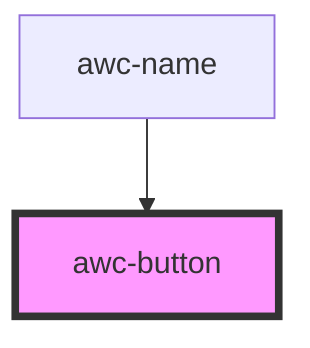

# awc-button

<!-- Auto Generated Below -->

## Properties

| Property | Attribute | Description     | Type                                                   | Default    |
| -------- | --------- | --------------- | ------------------------------------------------------ | ---------- |
| `color`  | `color`   | Button color    | `"black" \| "blue" \| "green" \| "red"`                | `'blue'`   |
| `margin` | `margin`  | Margin top size | `"large" \| "medium" \| "none" \| "small" \| "xsmall"` | `'none'`   |
| `size`   | `size`    | Button size     | `"large" \| "medium" \| "small" \| "xsmall"`           | `'xsmall'` |
| `text`   | `text`    | Button text     | `string`                                               | `''`       |

## Dependencies

### Used by

 - [awc-name](../awc-name)

### Graph

----------------------------------------------

*Built with [StencilJS](https://stenciljs.com/)*
