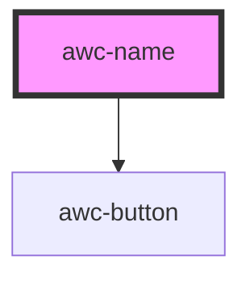

# awc-name

<!-- Auto Generated Below -->

## Properties

| Property        | Attribute         | Description     | Type                                         | Default                |
| --------------- | ----------------- | --------------- | -------------------------------------------- | ---------------------- |
| `first`         | `first`           | First name      | `string`                                     | `undefined`            |
| `greeting`      | `greeting`        | Greeting        | `string`                                     | `'Hello, World! I am'` |
| `hasGreeting`   | `has-greeting`    | Has Greeting    | `boolean`                                    | `false`                |
| `hasSizeButton` | `has-size-button` | Has size button | `boolean`                                    | `false`                |
| `last`          | `last`            | Last name       | `string`                                     | `undefined`            |
| `middle`        | `middle`          | Middle name     | `string`                                     | `undefined`            |
| `size`          | `size`            | Text size       | `"large" \| "medium" \| "small" \| "xsmall"` | `'medium'`             |

## Dependencies

### Depends on

- [awc-button](../awc-button)

### Graph

----------------------------------------------

*Built with [StencilJS](https://stenciljs.com/)*
